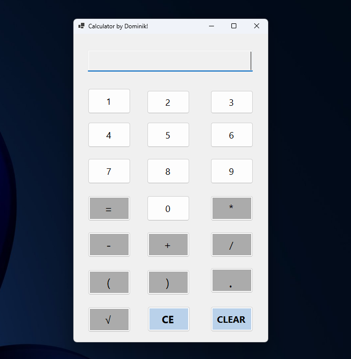

[ Go to HOME](../README.md)

# WinForms Calculator

A simple calculator application made with C# and Windows Forms.



## Note

- To use square root first type the number then press square root
- You can type whole math expresions
- Only certian operators will allow you to continue typing an expresion after you pressed equals

## How to Run

### Option 1 — Run the Executable

- Download the latest `.exe`
- Run the application

### Option 2 — Run From Source

1. Clone the repository:

```bash
git clone https://github.com/dtomasko/Csharp_learning


```

[ Go to HOME](../README.md)
