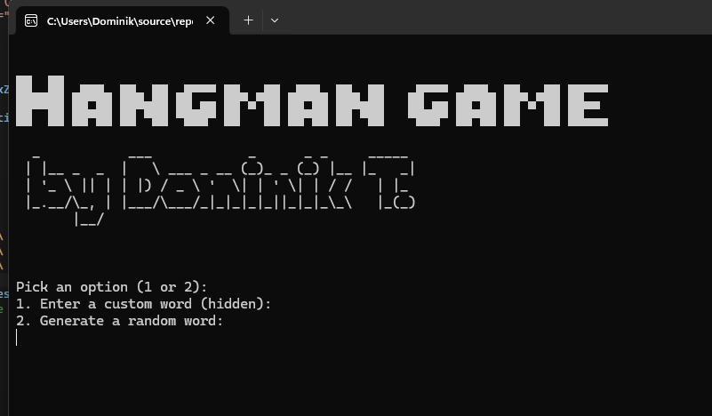
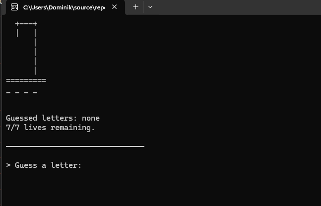

[ Go to HOME](../../README.md)

# Hangman Game (C# Console App)

A simple console-based Hangman game built in C# where the player guesses a hidden word before running out of lives.




## Features

- Custom hidden word input or random word generation
- 7 lives per game
- ASCII hangman stages
- Tracks guessed letters
- Win/lose detection
- Play again option

## Stack used

- C# (.NET Console App)
- Visual Studio (`.slnx`, `.csproj`)
- CrypticWizard Random Word Generator

---

## How to Run

```bash
dotnet run
```

[ Go to HOME](../../README.md)
